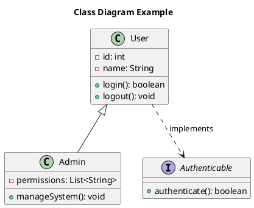

# Class Diagram

> [!WARNING]
> This is a sample use case diagram.

```plantuml
@startuml MasterCookVN
title Class Diagram Example

skinparam packageStyle rectangle

class User {
  - id: int
  - name: String
  + login(): boolean
  + logout(): void
}

class Admin {
  - permissions: List<String>
  + manageSystem(): void
}

interface Authenticable {
  + authenticate(): boolean
}

User <|-- Admin
User ..> Authenticable : implements
@enduml
```

<!-- diagram id="vitepress-plugin-digrams-class" -->

<!-- vim:set tabstop=4 softtabstop=4 shiftwidth=4: -->
